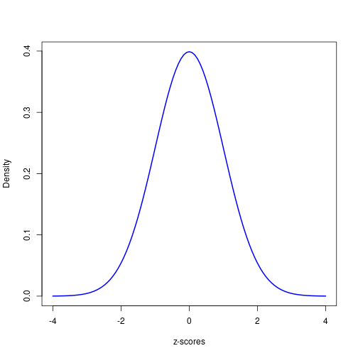
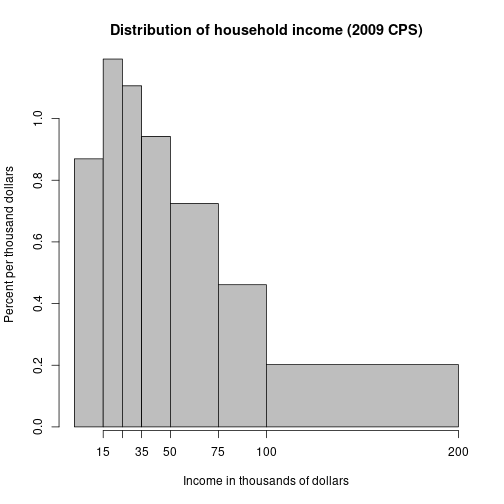

Normal distributions & z-scores
========================================================
author: Matthew Rudd
date: 31 January 2019
transition: none

English mothers in the 1890s
========================================================
left: 60%

***

 
The blue curve is the _**normal distribution**_ 
with average 62.45 and SD 2.36.

Heights, like lots of measurements, follow the normal curve well.

Beware that not all data is normal!

The 68-95-99.7 rule-of-thumb 
========================================================

Many _**histograms**_ follow the normal distribution; they are _**unimodal**_, _**symmetric**_, and _**bell-shaped**_. The _**average**_ and _**SD**_ are good summaries.

* About 68% of the data are within 1 SD of the average,

* about 95% are within 2 SDs of the average, and

* almost all (about 99.7%) are within 3 SDs of the average.

z-scores
==========

Compare normally distributed variables by converting 
to _**z-scores**_ (a.k.a. _**standardized statistics**_). 
For each observation,

- compute the _**deviation**_ from the average, then

- divide that deviation by the SD.

z-scores
==========

After standardizing observations, 

- 68% of the z-scores will be between -1 and +1,

- 95% will be between -2 and +2, and 

- almost all will be between -3 and +3.

The standard normal curve
========================================================
left: 60%

***

 
- Symmetric, unimodal
- Average: 0
- SD: 1
- **No units!**

The normal approximation for proportions
========================================

This theoretical approach works well when the observations include 

- at least 10 successes and
- at least 10 failures.

If these _**validity conditions**_ are not satisfied, 
don't use the normal approximation; use a simulation instead.

Look at the data first!
========================================================

If the distribution is clearly _**skewed**_, _**multimodal**_,
or _**asymmetric**_, 

- DO NOT use the average and SD as summaries,

- DO NOT invoke the 68-95-99.7 rule, and

- DO PROCEED WITH CAUTION!

Use the _**quartiles**_ as summaries: the _**median**_ is
the center and the _**IQR**_ describes spread.  

Other _**quantiles**_ (e.g., _**percentiles**_) are also useful.

Example: Household income
========================================================
left: 60%

*** 

Average income is larger than median income.

A long _**tail**_ pulls the mean of a distribution away from the median.
