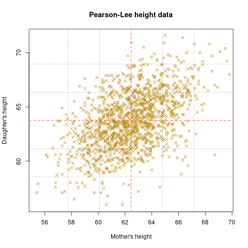
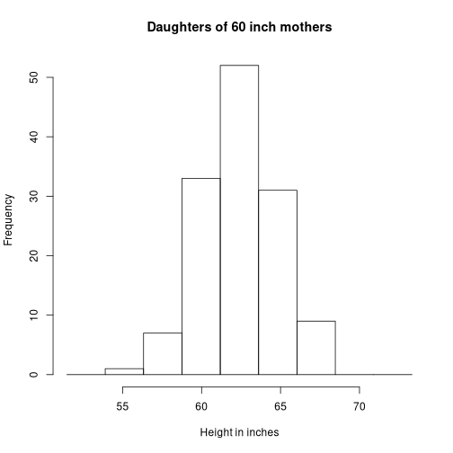
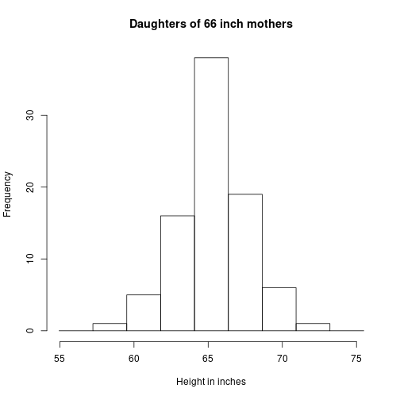

Relationships between quantitative variables
========================================================
author: Matthew Rudd
date: 11/30/20
transition: none

Motivation
========================================================
incremental:true

* Data  is often _**multivariate**_ ; we want to know how the variables relate. Variables 
can be _**quantitative**_ and/or _**categorical**_.
* For two quantitative variables, the basic tools are _**scatterplots**_, _**correlation**_,  and _**linear regression**_.

Scatterplots
========================================================
incremental:true

As always, start by _**plotting the data**_!

* _**Scatterplots**_ graph two quantitative variables simultaneously..
* Each point in a scatterplot corresponds to one observation.
* Look for an overall pattern. Is there a _**positive association**_, a _**negative association**_, 
or _**no association**_ ?

Example
========================================================
left: 25%

Heights of mothers and daughters:

***

More informative scatterplots
==============================
incremental: true
left: 25%

Scatterplots can also provide categorical information:

***

Correlation
=============
incremental: true

* The _**correlation**_  is a number between -1 and +1 that 
measures the _**linear**_ relationship shown in a scatterplot.
* The formula...
* Correlations can be very useful, but _**don't forget to look at the data!**_

Interpreting correlations
==========================
incremental: true

* Positive correlation corresponds to a positive association; negative correlation 
corresponds to a negative association.
* If _r_ is close to 0, the linear relationship is weak; this relationship is stronger when _r_ is closer to 1 or -1.
* _r_ = 1 and _r_ = -1 correspond to _**perfect**_  linear relationships. _**Never happens!**_

Anscombe's quartet
====================
left: 60%
incremental: true

***

_r_ is about 0.8 for all 4 data sets.

_r_ is only useful for one of these. (?)

Mothers and daughters 
========================================================
left: 60%

*** 

Mothers' average height: 62.45"

Mothers' SD: 2.36"

Daughters' average height: 63.75"

Daughters' SD: 2.6"

Correlation: 0.49

Short mothers
========================================================
left: 60%

*** 

Dark red points: 

5' mothers 

---

Best guess of daughter's height?

Short mothers
========================================================
left: 60%

***

Daughters' heights follow normal curve

**Average: 62.4"**

SD: 2.43"

---

**Average height above 60"**

Short mothers
========================================================
left: 60%

***

Dark blue point:

(60, 62.4)

---

**On the average**, a 5' mother's daughter is 
62.4 inches tall.

Short mothers
========================================================
left: 60%

***

5' mother : 

z = -1.04

---

Best guess of 62.4 :

z = -0.52

**Compare the product of r and mom's z: -0.51**

Tall mothers
========================================================
left: 60%

*** 

Dark red points: 

5'6" mothers

---

Best guess of daughter's height?

Tall mothers
========================================================
left: 60%

***

Daughters' heights follow normal curve

**Average: 65.22"**

SD: 2.28"

---

**Average height below 66"**

Tall mothers
========================================================
left: 60%

***

Dark blue point:

(66, 65.22)

---

**On the average**, a 5'6" mother's daughter is 
65.22 inches tall.

Tall mothers
========================================================
left: 60%

***

5'6" mother : 

z = 1.51

---

Best guess of 65.22 :

z = 0.56

**Compare the product of r and mom's z: 0.74**

Mothers and average daughters
========================================================
left: 60%

***

This process yields points that roughly follow a line.

**This is the _regression line_.**

The regression line always goes through the _**point of averages**_.

Mothers and average daughters
========================================================
left: 60%

***

To follow the _**regression line**_:

When mom's height changes by 1 SD, the daughter's _**predicted**_ average height changes 
by r SDs.

Remember which SD is which!

Linear regression
==================
incremental: true

If there is a linear relationship, what line best fits the data?  

* ``Best fit" :  _**The sum of the squares of the residuals is as small as possible.**_
* _**Residuals**_ are the differences between the real data and the predictions on the line.
* The _**line of best fit**_ is the _**regression line**_.

Linear regression
===================
incremental: true

* The slope of the regression line has the same sign as the correlation; the slope shows 
how the response changes when  changes.
* The _**coefficient of determination**_, _R^2_, measures the reduction in variability due to the explanatory variable; use it for assessment.
* Plotting residuals is another useful assessment; there should be no discernible pattern.

Caveats
=========
incremental: true

* Correlation and linear regression _**assume**_ a linear relationship; otherwise, don't use them!
* Watch out for _**influential observations**_ and _**lurking variables**_.
* The regression line can be useful for _**prediction**_ but not for _**extrapolation**_.

> 
 _**CORRELATION IS NOT CAUSATION!**_ 

